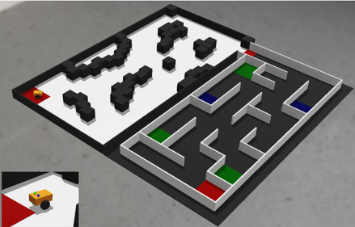
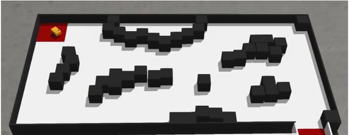
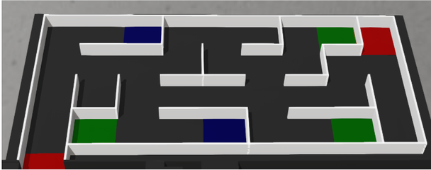

# PeraBots 2026 – Autonomous Robotics Challenge

[-success.svg)]()

Autonomous robot controller and simulation package for the **PeraBots 2026** University Category, organized by the **Department of Electrical & Electronic Engineering, University of Peradeniya**.

  

## 🎯 Competition Overview
PeraBots 2026 challenges teams to develop an autonomous robot to navigate environments without manual intervention or hard-coded coordinates. 
* **Phase 1 (Online):** Webots R2025a simulation.
* **Phase 2 (Physical):** Deploy physical robots ($\le 20 \times 20 \times 20\text{ cm}$) on a real-world track.

## 🚀 The Challenge

### Section 1: Autonomous Obstacle Navigation
Navigate a $2.44\text{m} \times 1.22\text{m}$ obstacle field from the starting zone to the transition area in minimal time without collisions.

### Section 2: Maze Exploration & Decision-Making
Explore a $9 \times 4$ maze, count blue/green tiles at dead ends, identify the majority color, navigate to the end cell, and illuminate the corresponding LED.

## 🤖 Our Implementation (Section 1)
Our current controller (`controllers/main_controller/main_controller.py`) completes Section 1 optimally in **~18.3 seconds**.

* **Robot Setup:** Two-wheel differential drive, 9 distance sensors (180° coverage), and IMU for accurate orientation.
* **Mapping:** 2D log-odds occupancy grid (2cm resolution) with dynamic obstacle inflation.
* **Path Planning:** 8-connected A* search with Octile heuristic and line-of-sight path smoothing ("string pulling").
* **Control:** Pure-pursuit tracking with adaptive speed and an integrated stuck-recovery state machine.

## 🏁 Getting Started
1. Install [Webots R2025a](https://cyberbotics.com/) and Python 3.10+.
2. Clone this repository and open `worlds/Arena.wbt` in Webots.
3. Press **Play** to start the autonomous simulation.
